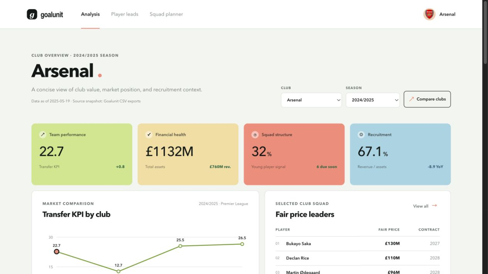
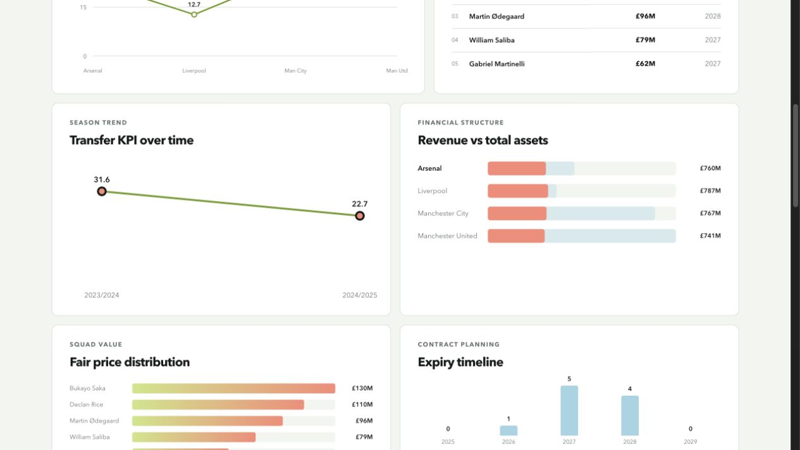
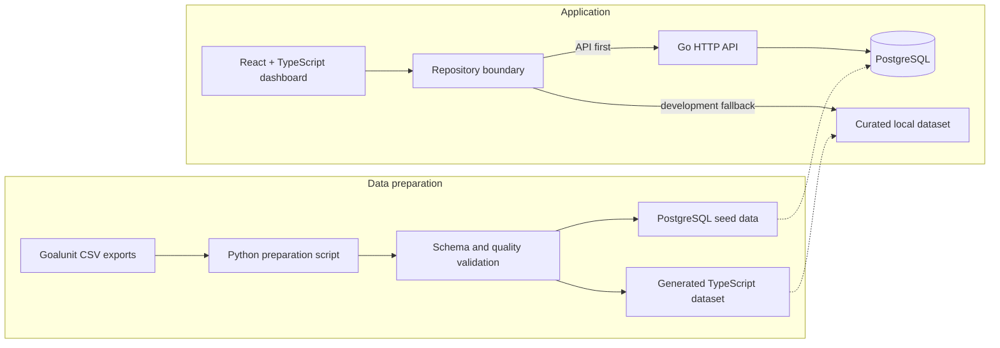
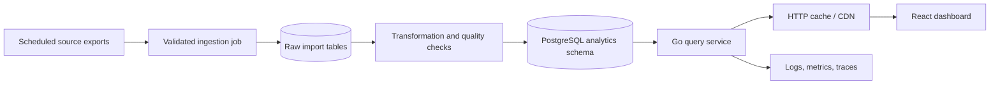

# Goalunit Club Analysis

A football intelligence dashboard for exploring club performance, financial structure, squad value, and contract risk. The project demonstrates an end-to-end analytics workflow: validating raw CSV exports, modelling football data, exposing an API-shaped repository, and presenting the results through an interactive React dashboard.

[View the live demo](https://goalunit-dashboard.vercel.app/) · [Explore the data pipeline](#dataset-methodology) · [Review the architecture](#architecture)

## Product screenshots

[](https://goalunit-dashboard.vercel.app/)

_Club and season filters, performance indicators, market comparison, and fair-price leaders._



_Season movement, financial structure, player-value distribution, and contract-expiry planning._

## What the dashboard does

- Compares Transfer KPI values across Premier League clubs.
- Switches between clubs and seasons while recalculating every dependent metric.
- Ranks players by estimated fair price and supports multi-field player search.
- Highlights contracts expiring within two years of the selected season.
- Compares revenue with total assets and shows year-over-year KPI movement.
- Generates concise findings about performance, value concentration, and contract exposure.
- Reads from a Go API when available and falls back to the local typed dataset.

## Example analytical findings

The figures below describe the curated `2024/2025` portfolio sample and should not be interpreted as league-wide conclusions:

- Arsenal records a **22.7 Transfer KPI**, approximately **0.9 points above** the four-club sample average.
- Manchester United has the sample's highest Transfer KPI at **26.5**, while Liverpool has the lowest at **12.7**.
- Arsenal's top three players account for **48.8%** of the selected squad sample's total fair price, indicating concentrated player value.
- Arsenal's revenue-to-assets ratio is **67.1%** based on £760.1M revenue and £1.13B total assets.
- Six Arsenal players in the sample have contracts expiring by the end of the two-year review window.
- Arsenal's Transfer KPI decreases by **8.9 points** from `2023/2024` to `2024/2025` in the sample.

## Architecture



The React components depend on [`src/data/goalunitRepository.ts`](src/data/goalunitRepository.ts), rather than importing transport details directly. The repository requests `/api/clubs/:clubId/overview` and normalizes the response to a single `ClubOverview` model. If the service is unavailable, it returns the equivalent view from local TypeScript data. The Go service also exposes filterable club, player, and contract-risk collections.

The backend in [`backend/`](backend/) includes a Go HTTP service, PostgreSQL schema, seed data, resource handlers, and derived overview query. During local development, Vite proxies `/api` to `http://localhost:8080`.

## Dataset methodology

### Source and scope

The repository includes two Goalunit-style source exports:

- [`src/data/clubs.csv`](src/data/clubs.csv): 40 club-season records across `2023/2024` and `2024/2025`.
- [`src/data/players.csv`](src/data/players.csv): 1,148 raw player snapshots across the same two seasons.

The visible dashboard is intentionally smaller than the source exports. Its curated local model contains four comparison clubs across two seasons and a selected player sample suitable for demonstrating the analytical interactions.

### Preparation rules

[`scripts/prepare_data.py`](scripts/prepare_data.py) converts the CSV exports into typed frontend-ready records:

1. Read UTF-8 CSV files and trim surrounding whitespace.
2. Convert blank values to `null` and parse numeric columns.
3. Preserve required club, player, and season identifiers.
4. Deduplicate club records by `clubId + seasonId`.
5. Deduplicate player snapshots by `playerId + seasonId`, retaining the highest fair-price observation.
6. Sort prepared players by fair price before generating TypeScript.
7. Validate the complete prepared collection before writing any output.

The supplied player export does not contain `clubId`. [`src/data/playerClubMap.ts`](src/data/playerClubMap.ts) therefore provides an explicit `playerId + seasonId` assignment for the curated dashboard sample. This avoids inferring club membership from player names.

### Validation contract

The preparation boundary rejects output containing:

- Missing, non-integer, or non-positive club, player, and season IDs.
- Seasons outside the consecutive `YYYY/YYYY` format.
- Negative or non-finite asset, revenue, or fair-price values.
- Fair prices above the €1 billion sanity threshold.
- Contract dates that are not real ISO `YYYY-MM-DD` calendar dates.
- Duplicate club-season or player-season records.

Validation errors are aggregated so a failed preparation run reports every discovered issue and writes no partial output.

### Derived metrics

- **Season average:** arithmetic mean of Transfer KPI across the selected comparison clubs.
- **KPI delta:** selected club Transfer KPI minus the season sample average.
- **Year-over-year movement:** current Transfer KPI minus the matching club's previous-season KPI.
- **Revenue-to-assets ratio:** `total revenues / total assets × 100`.
- **Fair-price concentration:** top-three player fair prices divided by total squad-sample fair price.
- **Contract risk:** players whose contract year is no later than two years after the selected season end.

## Known limitations

- The data is a static portfolio snapshot dated **2025-05-19**, not a live Goalunit feed.
- The dashboard uses a deliberately small club and player sample; findings are illustrative rather than comprehensive.
- Player-to-club assignments are manually curated because the player CSV lacks a club identifier.
- Fair price is treated as a supplied estimate; this project does not reproduce or audit its underlying valuation model.
- Contract risk uses season-end years rather than a precise rolling date calculation.
- Currency is presented consistently in the interface, but the source export does not provide a per-record currency field.
- The local fallback and database seed must currently be kept in sync manually.
- Authentication, authorization, pagination, caching, observability, and production API rate controls are outside the prototype scope.

## Future Go/PostgreSQL architecture

The next production-oriented iteration would make PostgreSQL the authoritative store and remove the curated frontend data bridge:



Planned improvements include authoritative player-club-season relationships, database constraints matching the preparation validator, versioned API contracts, server-side filtering and pagination, scheduled ingestion, data-quality reporting, and deployment health checks.

## Tech stack

- React 19 and TypeScript
- Vite
- CSS and inline SVG visualizations
- Vitest, Testing Library, and jsdom
- Python CSV preparation and validation
- Go HTTP API
- PostgreSQL schema and seed data
- GitHub Actions CI

## Getting started

Install dependencies and start the frontend:

```bash
npm install
npm run dev
```

The application is available at the local URL shown by Vite, usually `http://localhost:5173`.

To regenerate the typed dataset from CSV files:

```bash
npm run prepare:data -- \
  --clubs /path/to/clubs.csv \
  --players /path/to/players.csv
```

This writes `src/data/goalunitData.generated.ts`. See [`backend/README.md`](backend/README.md) for PostgreSQL and Go service setup.

## Quality checks

```bash
npm test
npm run build
npm run lint
```

The test command runs the Python preparation tests, the Vitest data/component suites, and the Go API handler tests. The GitHub Actions workflow runs clean installation, tests, production build, and linting for every push and pull request.

## Project structure

```text
backend/                 Go API, SQL schema, queries, and seed data
docs/screenshots/        Portfolio screenshots
scripts/prepare_data.py  CSV preparation and validation
src/components/          Dashboard tables, charts, and search UI
src/data/                Source CSVs, typed data, mappings, and repository
src/App.tsx              Dashboard composition and interactions
tests/                   Python data-pipeline tests
```
